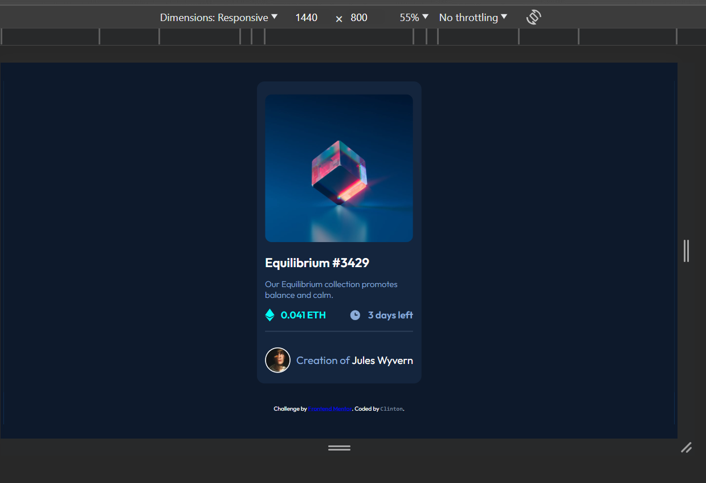
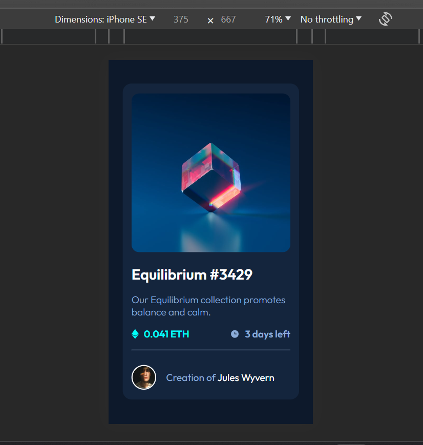

# Frontend Mentor - NFT preview card component solution

This is a solution to the [NFT preview card component challenge on Frontend Mentor](https://www.frontendmentor.io/challenges/nft-preview-card-component-SbdUL_w0U). Frontend Mentor challenges help you improve your coding skills by building realistic projects. 

## Table of contents

- [Overview](#overview)
  - [The challenge](#the-challenge)
  - [Screenshot](#screenshot)
  - [Links](#links)
- [My process](#my-process)
  - [Built with](#built-with)
  - [What I learned](#what-i-learned)
  - [Continued development](#continued-development)
  - [Useful resources](#useful-resources)
- [Author](#author)


## Overview
  This addresses the challenge of the [NFT preview card component on Frontend Mentor], and it has been coded by clintt-09.

Two screenshots are available, showcasing the Desktop and Mobile views. Additionally, there are provided links to both the GitHub repository and the live site hosted on Netlify.

### The challenge

Users should be able to:

- View the optimal layout depending on their device's screen size
- See hover states for interactive elements

### Screenshot

Desktop view (1440 x 800)




Mobile view (375 x 667)



### Links

- Solution URL: [Solution On Frontend Mentor](https://your-solution-url.com)
- Live Site URL: [ace-2.netlify.app](https://ace-2.netlify.app/)

## My process
  Here are the tools and technologies I employed to address this challenge, insights gained throughout the problem-solving journey, areas in which I aspire to enhance my skills in the coming days, and articles that proved beneficial for me, potentially aiding others in overcoming similar challenges on Frontend Mentor or elsewhere.

  This is the approach I took to address this challenge.

### Built with

- Semantic HTML5 markup
- CSS custom properties
- Flexbox
- Mobile-first workflow

### What I learned

Despite the primary focus of the solution, the most important insight I gained from this challenge was the application of z-index and the relationships between parent and child elements in CSS.

I encountered some minor challenges, particularly with the active state design solution, but I managed to overcome them with assistance.

```css
.pic-container img:hover{
    z-index: -1;
    opacity: .5;
}
```

I experimented with a Mobile-first approach and discovered that I had been overlooking something significant... and, surprisingly, it was an enjoyable experience!

### Continued development

I think I still have room for improvement in Responsive Design. I'm in the process of learning and anticipate that as I tackle more challenges, I'll gain the ability to effortlessly design pages for various screen sizes.

### Useful resources

- [MDN Web Docs](https://developer.mozilla.org/en-US/) - This is was a clear and concise documentation that helped me lots during this challenge. I believe every web developer is familiar with it but I still need to mention it in case.
- [A Complete Guide to CSS Media Queries by css-tricks](https://css-tricks.com/a-complete-guide-to-css-media-queries/) - This article helped me understand Media queiries to a decent degree and helped me make my solution Mobile friendly. I recommend to anyone struggling with Media queries.

## Author

- Frontend Mentor - [@clintt-09](https://www.frontendmentor.io/profile/clintt-09)
- Twitter - [@clinttfr](https://www.twitter.com/clinttfr)
